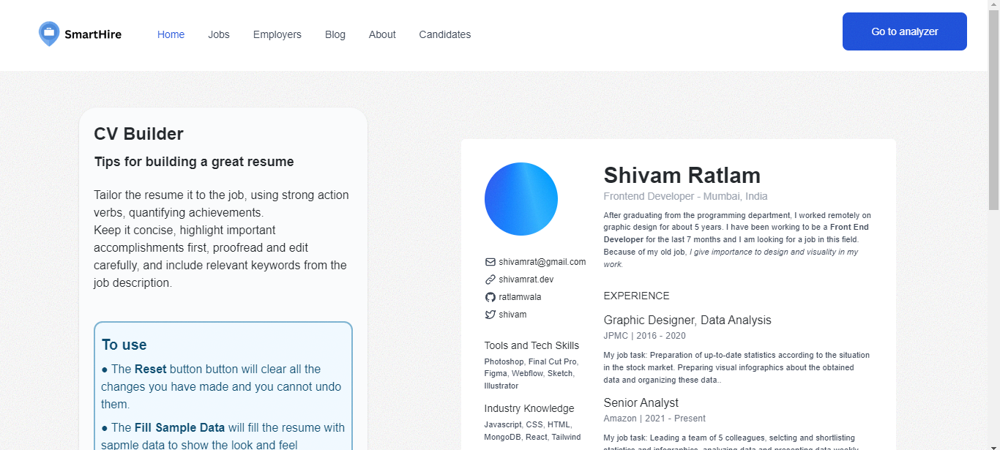

# Resume Builder 🏅

Welcome to the Resume Builder project! This tool allows you to effortlessly create a professional CV by simply providing information about yourself, your skills, education, projects, and work experiences. Additionally, it offers a variety of templates to choose from, ensuring that your CV reflects your unique style.

<br/>
<p align="center">
  
</p>

## Features

### 1. User-Friendly Interface 🚀
The tool provides a simple and intuitive interface, making it easy for users of all levels to input their information effortlessly. The clean and organized design ensures a smooth and enjoyable user experience.
### 2. Template Selection 📝
Choose from a diverse range of professionally designed templates to tailor your CV, ensuring it not only showcases your qualifications but also reflects your unique style. Experiment with different templates to find the one that best suits your professional identity.
### 3. Sections for Every Detail ✍🏻
The application prompts you to provide detailed information about yourself, your skills, education, projects, and work experiences. This ensures that your CV is comprehensive and captures all the essential aspects of your professional journey. The detailed sections help you present a well-rounded and compelling professional profile.
### 4. Preview Option ⏪
See a real-time preview of your CV before finalizing. This feature allows you to make instant adjustments and ensures that your CV meets the highest standards of professionalism. The preview option lets you review and fine-tune your CV until you are completely satisfied with the result.
### 5. Download and Share 🔗
Once satisfied with the preview, download your CV in various formats such as PDF or Word. You can also share your CV directly through the application, streamlining the process of sending your professional profile to potential employers. The download and share options provide flexibility and convenience in sharing your CV with employers, colleagues, or on professional networking platforms.

## Getting Started 🚀

1. **Clone the Repository**:
   ```bash
   git clone https://github.com/Idris110/CV-builder
   ```

2. **Navigate to the Project Directory**:
   ```bash
   cd CV-builder
   ```

3. **Install Dependencies**:
   ```bash
   npm install
   ```

4. **Run the Application**:
   ```bash
   npm start
   ```
   The application will be accessible at `http://localhost:3000` by default.

## Usage 

1. Open the application in your web browser.
2. Fill in the details in each section, such as About Yourself, Skills, Education, Projects, and Experiences.
3. Choose a template that suits your preferences.
4. Preview your CV to ensure everything looks as expected.
5. Download your CV in the desired format or share it directly.

## Contributing 🛠️

We welcome contributions from the community! If you have ideas for improvements or bug fixes, feel free to open an issue or submit a pull request.


